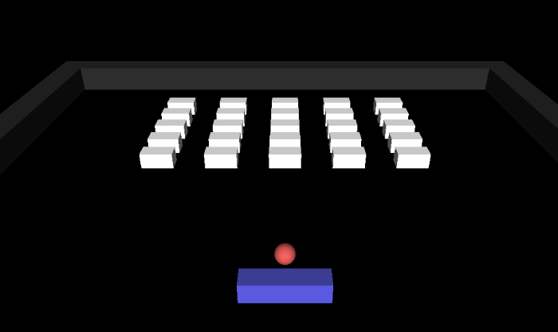

# MonaEngine Demos

Repositorio de ejemplos prácticos para Mona Engine: https://github.com/dantros/MonaEngine

Estos ejemplos se proponen como una herramienta de auto-aprendizaje para explorar distintas funcionalidades del motor.

# Breakout

Una versión minimalista de Breakout. Se ejercita lo siguiernte:
- Generación de primitivas básicas que son parte del Engine.
- Sonidos 2D.
- Implementación de colisiones vía componentes físicas.
- Uso alternativo de teclado y joystick.

# AnimationAudio

En este ejemplo se ejercítan varios sistemas:
- Animación por esqueletos.
- Control del personaje vía uso del mouse.
- Operación de raycast vía clic en la escena para fijar el destino del personaje.
- Espacialización de audio. Los objetos emiten distintos sonitos, los que se atenuarán al alejarse de ellos.
- El micrófono de la escena está atachado al personaje, por lo que un setup de parlantes o audífonos estéreo permitirá apreciar el efecto de espacialización al rotar el personaje.

# Assets usados

Para la implementación de los ejemplos desarrollados con el motor se usaron los siguientes assets:
 - Animaciones, mallas y esqueletos desde el sitio https://www.mixamo.com/#/.
 - [Sonido de aire acondicionado](https://freesound.org/people/addiofbaddi/sounds/241702/) bajo la licencia CC0.
 - [Drumloops](https://freesound.org/people/Bronxio/sounds/199870/) bajo la licencia CC0.
 - [Golden Super Fly Boombox Roblox Remake](https://sketchfab.com/3d-models/golden-super-fly-boombox-roblox-remake-d2b9b14dd01e4fa0bdd3b1704fcb2b2f) hecho por el artista Sir_Numb y bajo la licencia CC.
 - [Drakefire Pistol](https://sketchfab.com/3d-models/drakefire-pistol-bee02e85f22d4eaaa3c0144f11204843) hecho por el/la artista [Teliri](https://www.artstation.com/artwork/3XE92) y bajo la licencia CC.
 - [Air Conditioner Low Poly](https://sketchfab.com/3d-models/air-conditioner-low-poly-textured-game-asset-84c4e55948414c6db2473da7b6e9cbb7) hecho por el artista [Karthik Naidu](instagram.com/k3dart) y bajo la licencia CC.